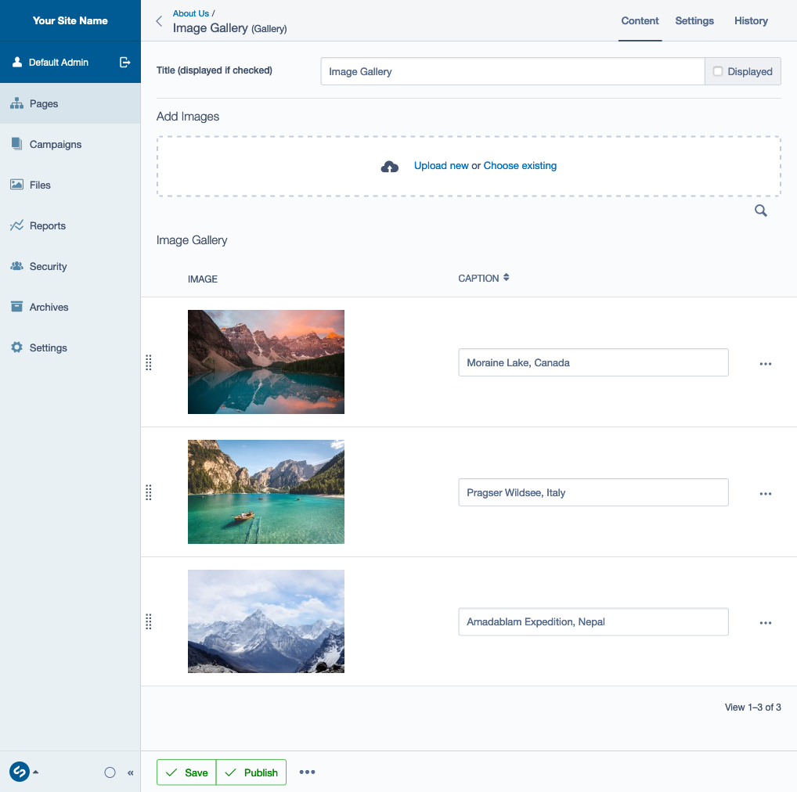

# Basic Image Gallery Elemental Block (Silverstripe)

## Introduction

A simple image gallery block for Silverstripe CMS's Elemental module. Uses [Basic Image Gallery Extension](https://github.com/purplespider/silverstripe-basic-gallery-extension) to provide bulk uploading, drag & drop reordering and inline caption editing.

The template displays the images as square thumbnails with a link to larger versions and works wirth the [Fancybox](https://fancyapps.com/fancybox/) lightbox module out of the box. The template can be easily overridden to work with the lightbox of your choice or to make a slideshow, etc.



## Maintainer Contact

-   James Cocker (ssmodulesgithub@pswd.biz)

## Requirements

-   Silverstripe 5

## Installation Instructions

```

composer require purplespider/silverstripe-elemental-basic-gallery ^3

```
